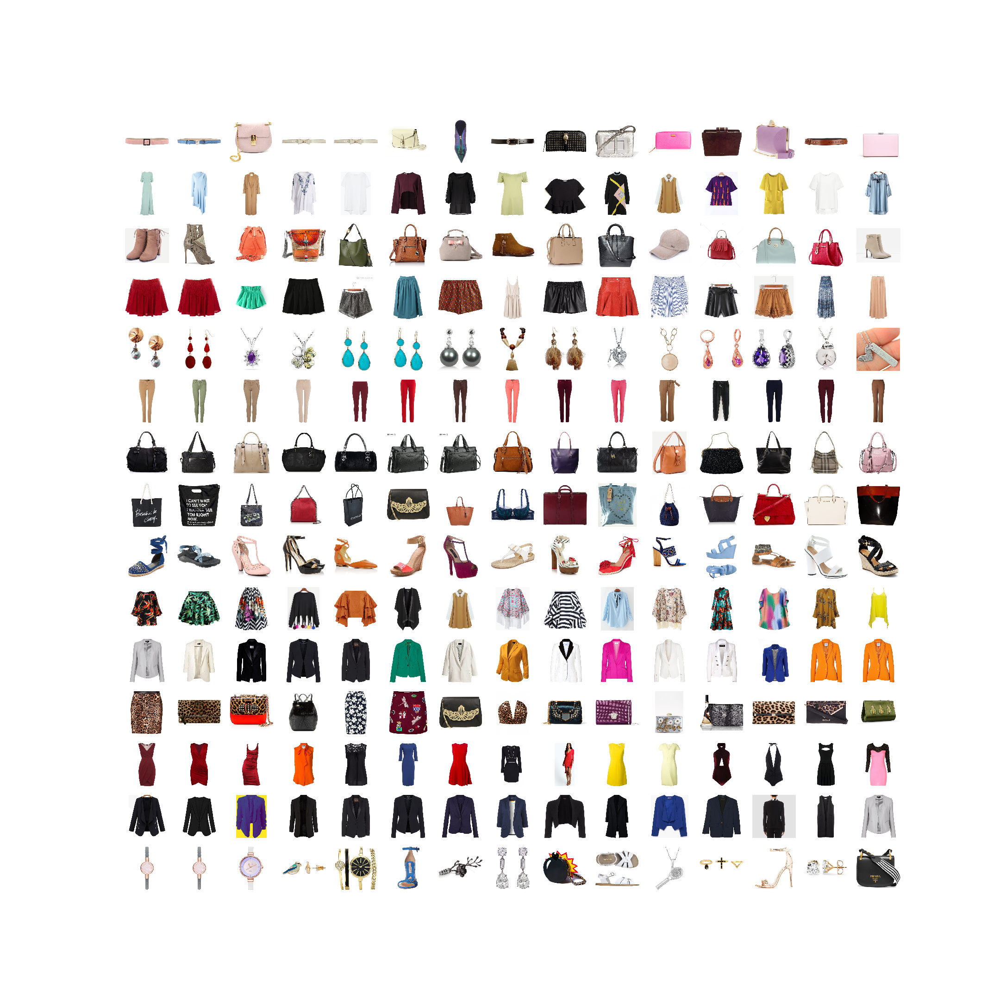
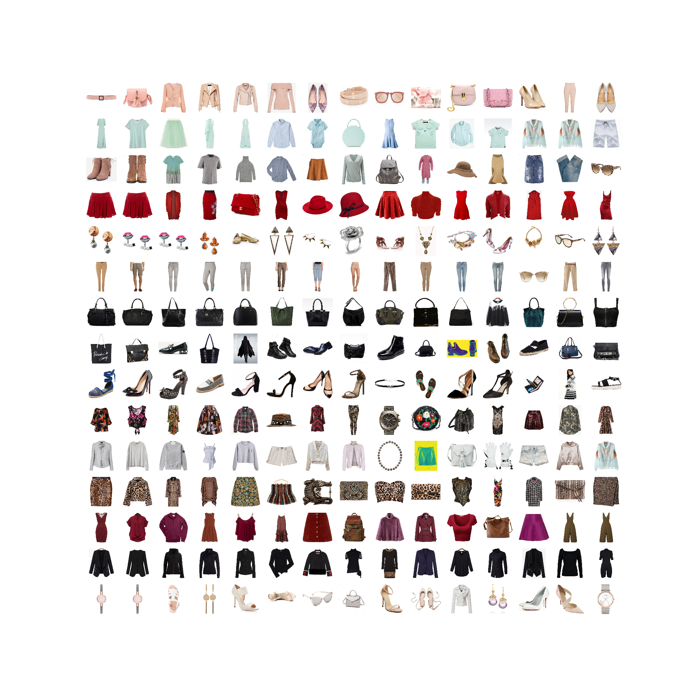
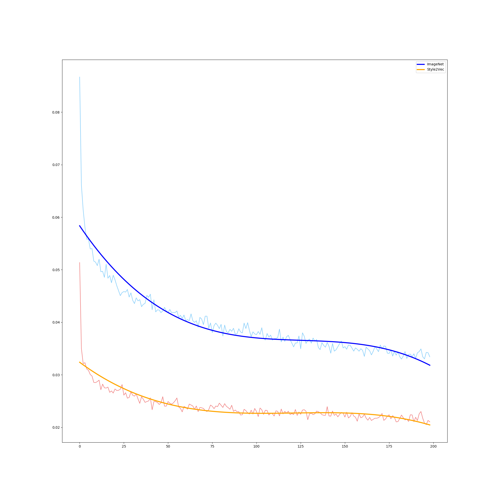
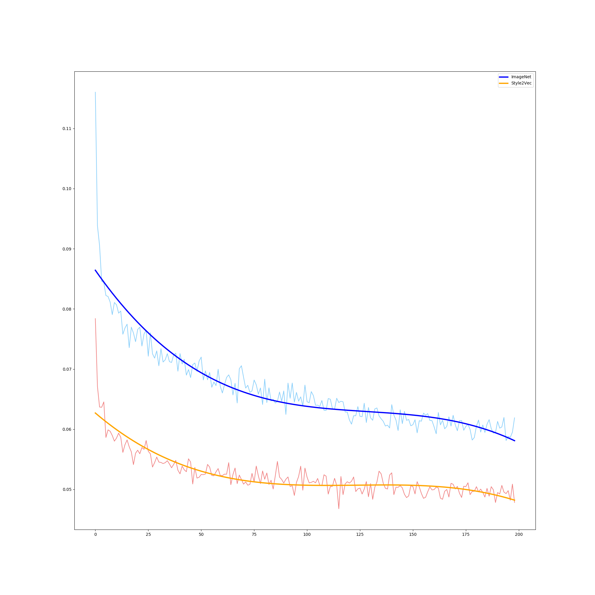
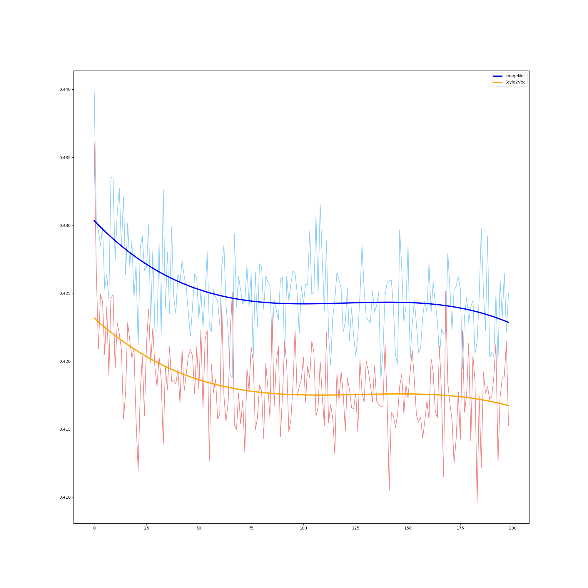
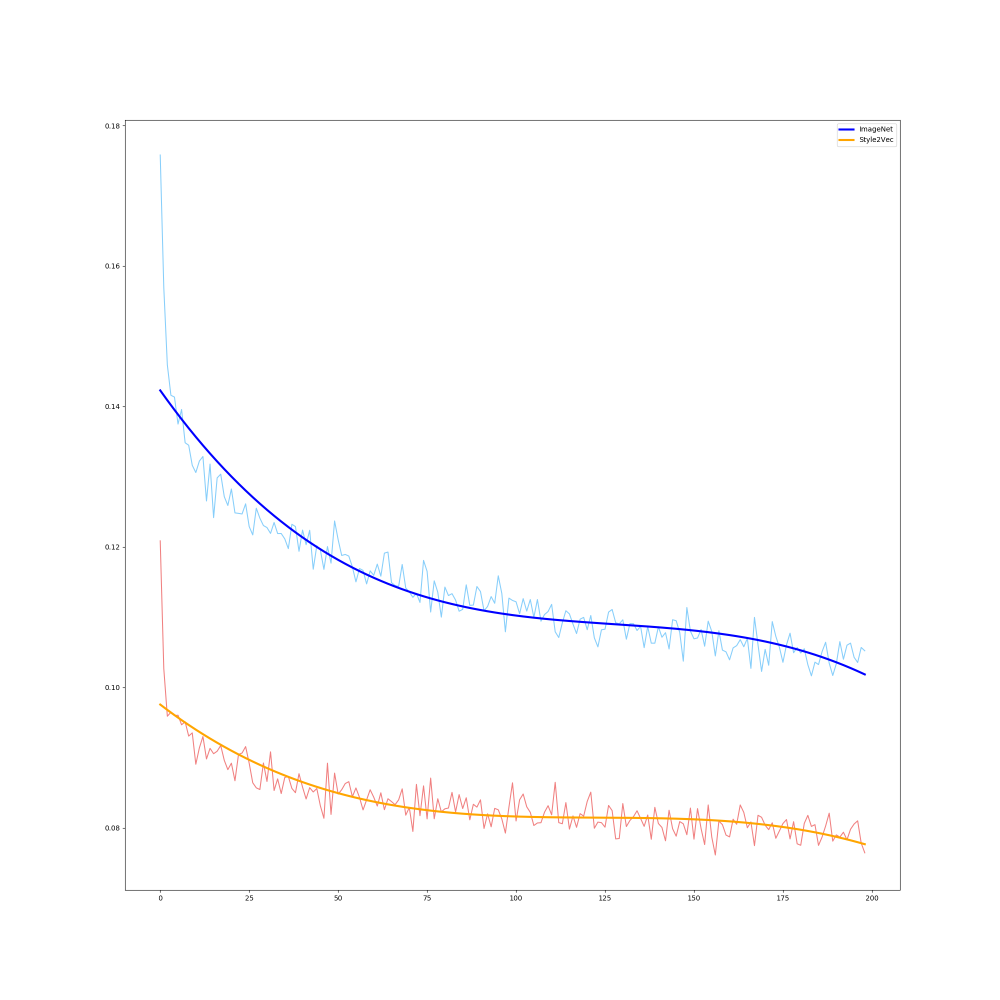
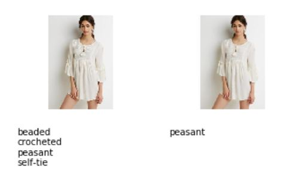
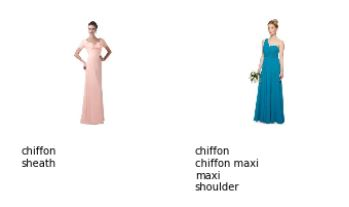

# Style2Vec Report

---

## Problem Definition
The goal of this experiment is to implement a model for fashion products vector representation based on Style2Vec paper[^1]. The final model should be able to create fashion items embedding, where items with similar style are near to one another in the embedding space. The motivation is to use such embedding in some kind of outfit recommendation task, e. g. to create an outfit containing a selected item and matching items from other product categories.

## Data Description
### Training Data
_Polyvore Dataset_[^2] was used for training the model. It is made out of outfits obtained from `polyvore.com`, a former website allowing users to create outfits out of various fashion products. The original dataset contains 21,889 outfits with on average 6.5 fashion items. There is an image of each item, usually on a white background, and some additional information, e. g. number of likes, price, and so on. To improve the representation we cleaned the dataset of items from 191 non-wearable categories such as furniture, make-up, etc. Then we removed outfits with less than 3 items.

### Validation Data
For model evaluation _DeepFashion: Attribute Prediction Dataset_[^3] was used. It contains 289,222 images of fashion products, some of them on white background but most of them worn by models. We used the validation partition of this dataset containing 40,000 items. That is why bounding boxes are provided to eliminate the noise of the background. There are 1,000 item attributes divided into 5 attribute types - texture-related, fabric-related, shape-related, part-related and style-related attributes. The distribution of the number of attributes for each item is as follows:

|Property|Value|
|--|--|
|__Mean:__   |  3.31|
|__Standard deviation:__ | 1.95|
|__Minimum:__ | 0|
|__25%:__ | 2|
|__50%:__ | 3|
|__75%:__ |4|
|__Maximum:__ | 15|

The following table describes the distribution of number of items with selected attribute.

|Property|Value|
|--|--|
|__Mean:__   |  132|
|__Standard deviation:__ | 322|
|__Minimum:__ | 1|
|__25%:__ | 15|
|__50%:__ | 37|
|__75%:__ |109|
|__Maximum:__ | 5178|

## Experiment Description
The approach is inspired by Word2Vec[^4] model that is based on word cooccurrence in a context window. In our model, a fashion item is treated as a word and outfits correspond to context windows. The model uses two deep convolution neural networks for image feature extraction. One of the networks is used as a projection to target item embedding vector and the other is used for projection of context items to their weight vectors. Dot product is computed between the target item embedding vector and each context item in the same outfit, the output is then passed to the softmax function. The goal is to maximize the probability of co-occurrence of items in the same outfits. More theoretical details can be found in the original paper[^1].

## Implementation
The model is constructed with Keras Functional API. Two InceptionV3 networks are used with initial weights from the ImageNet classification task. Only the top 61 layers of these networks are trained. We don't compute the softmax function since it's expensive, we use negative sampling instead. The output of the networks is passed to dot product from which a sigmoid function is computed. For each item, a few items from other outfits are chosen as negative samples. Binary cross-entropy loss function is used because we want the model output of positive samples (two samples from the same outfit) to be 1 and of negative samples (samples from different outfits) to be 0. The final model was trained with minibatch gradient descent with a batch size of 32, adam optimizer with default parameters for 5 epochs.

## Evaluation
We wanted to test the hypothesis, that products close to each other in the embedding share the same style. To validate this hypothesis, we decided to check the relation of embedding vector distance with the number of common attributes of the products, that is why we used the above-mentioned validation dataset.
Method:
1. For a large number of randomly chosen samples, we find their nearest neighbors.
2. For each neighbor we compute the Jaccard index with the original item, so for each sample chosen in step 1, we get a sequence of indices.
3. We average all the sequences obtained from step 2.

We applied this method for our model and compared it with the original InceptionV3 model trained for ImageNet task (further as ImagetNet model). 

## Results

### ImageNet vs Style2Vec 
As our model is initialized with ImageNet weights, we wanted to compare the embedding created by ImageNet model with our Style2Vec embedding. On images bellow you can see visualizations of these embeddings. The first column contains selected images and other columns contain their nearest neighbors ordered from the closest one.
As you can see, ImageNet model focuses more on shape of the items in comparison to Style2Vec model which tends to put similar colors and textures near to each other.

#### ImageNet

#### Style2Vec

### Evaluation Results

On figures below, the horizontal axis represents the order from the original item and the vertical axis shows the averaged Jaccard index. Note that the Jaccard index of empty sets is defined as 1 and the dataset is sparsely labeled, so the plots have rather comparative nature. We tried various sets of attributes and attribute types for the comparison. We hypothesized that the ImageNet model would perform better on the shape and part related attributes and that our model would perform better on more general attributes and style-related attributes.

### All attributes

### Texture, fabric and style related attributes

### Shape and part related attributes

### Style related attributes

### All attributes with more than 500 products

### Validation dataset suitability
We questioned the dataset suitability for our validation task. We concluded that the attribute labeling may not be precise enough for our task. We found the following problems:
1. __Same product with different attributes__
On the figure below you can see two samples of the same product and their attributes. Commonly, even the same products have different attributes.

2. __Sparsity__
Another problem is that the labeling is quite sparse meaning that products are often not labeled with their evident attributes and that is why the number of attributes of each item is that low. As you can see neither of the dresses below has part related attribute nor color attribute in spite of that those attributes are present in the dataset. 

3. __Too specific attributes__
As you could deduce from the data description above, the majority of the attributes are too specific. That is not convenient for our task, because our model has no ambition to learn those specific attributes. This problem could be solved by removing those attributes, but that exacerbates the sparsity problem.

## Conclusion
We implemented and trained the Style2Vec model. Judging from the visualization, the model creates an embedding, where items of similar colors and textures are close to each other. However, the performance of the model stays unclear because of the unconvincing validation task and data. The question arose whether our expectation that products close to each other would have similar attributes is valid or we should choose completely different validation task.

[^1]: [Style2Vec: Representation Learning for Fashion Items from Style Sets](https://arxiv.org/abs/1708.04014)
[^2]: [Polyvore Dataset](https://github.com/xthan/polyvore-dataset)
[^3]: [DeepFashion: Attribute Prediction Dataset](http://mmlab.ie.cuhk.edu.hk/projects/DeepFashion/AttributePrediction.html)
[^4]: [Efficient Estimation of Word Representations in Vector Space](https://arxiv.org/abs/1301.3781)
